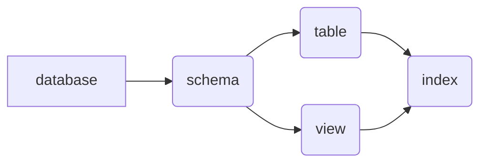

the whole relationship is like this:


```mermaid

graph LR
    A[database] --> B(schema)
    B --> C(table)
    B --> D(view)
    C --> E(index)
    D --> E

```

# database

## create

```
create database <your database name>
```

