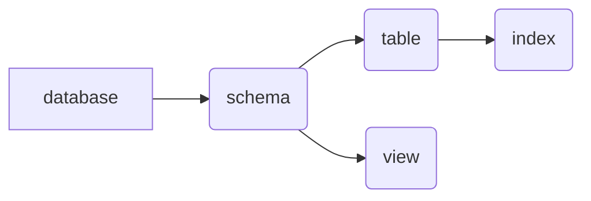

the whole relationship is like this:



# database

## create

```mysql
create database <your database name>
```

# schema 

## create 

```mysql
create schema <your schema name>
```

> However, in mysql, it seems that database and schema is the same thing.

# table

before creating a table, you need to use command `use` to choose your schema.

```mysql
use <your schema name>
```

## create 

```mysql
create table <your table name>(
    name type [condition],
    name type [condition],
    ...
)
```

the condition can be filled with:

|condition|explanation|
|-|-|
|primary key| 主键，可以唯一标识对应的记录|
｜foreign key｜外键，与某表的主键相连｜
｜not null|属性不能为空|
|unique|属性的值是唯一的|
|auto_increment|属性值自动增加|
|default|默认值|

you can choose different types like:

|type|explanation|
|-|-|
|int| 长整数|
｜smallint｜短整数｜
｜numeric(p,d)|定点数，共p位，右面d位|
|real|浮点数|
|double|双精度|
|float|浮点数|
|char(n)|固定长度n的字符串|
|varchar(n)|可变长度字符串，最大为n|
|data|日期（年，月，日）|
|time|时间（时，分，秒）|

```mysql
create table <your table name>(
    ...

    primary key(name1,name2),
    foreign key(name3) references table0(name4),
)
```

this command means that the primary key of table is (name1,name2), and it refers to another table `table0`.

## modify

```mysql
alter table <your table name>
add [column] <new col name> <type> [condition]
add <condition>
drop [column] <ori col name> [cascade|restrict]
alter column <ori col name> <type>
rename to <new table name>
change <origin col name> <new col name> <type> 
modify <col name> <type>
```


## delete

```mysql
drop table <your table name> [restrict|cascade]
```

# index

## create

```mysql
create [unique] [cluster] index <index name>
```

## modify

```mysql
alter index <old name> rename to <new name>
```

## delete

```mysql
drop index <name>
```