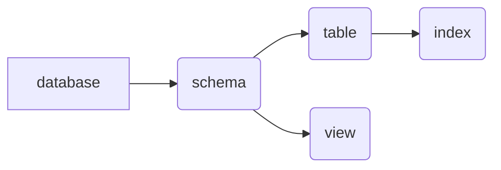

the whole relationship is like this:



# database

## create

```
create database <your database name>
```

# schema 

## create 

```
create schema <your schema name>
```

> However, in mysql, it seems that database and schema is the same thing.

# table

before creating a table, you need to use command `use` to choose your schema.

```
use <your schema name>
```

## create 

```
create table <your table name>(
    name type [condition],
    name type [condition],
    ...
)
```

the condition can be filled with:

|condition|explanation|
|-|-|
|primary key| 主键，可以唯一标识对应的记录|
|foreign key|外键，与某表的主键相连|
|not null|属性不能为空|
|unique|属性的值是唯一的|
|auto_increment|属性值自动增加|
|default|默认值|

you can choose different types like:

|type|explanation|
|-|-|
|int| 长整数|
|smallint|短整数|
|numeric(p,d)|定点数，共p位，右面d位|
|real|浮点数|
|double|双精度|
|float|浮点数|
|char(n)|固定长度n的字符串|
|varchar(n)|可变长度字符串，最大为n|
|data|日期（年，月，日）|
|time|时间（时，分，秒）|

```
create table <your table name>(
    ...

    primary key(name1,name2),
    foreign key(name3) references table0(name4),
)
```

this command means that the primary key of table is (name1,name2), and it refers to another table `table0`.

## modify

```
alter table <your table name>
add [column] <new col name> <type> [condition]
add <condition>
drop [column] <ori col name> [cascade|restrict]
alter column <ori col name> <type>
rename to <new table name>
change <origin col name> <new col name> <type> 
modify <col name> <type>
```


## delete

```
drop table <your table name> [restrict|cascade]
```

# index

## create

```
create [unique] [cluster] index <index name>
```

## modify

```
alter index <old name> rename to <new name>
```

## delete

```
drop index <name>
```

# find data

generally, the command is like:

```
select [all|distinct] <column> [,<column>]
from <table> [,<table>] 
[where <condition>]
[group by <column> [having <condition>]]
[order by <column> [asc|desc]]
```
**distinct** means there is no repeat in data.

## select

```
select Sno,Sname
from Student;
```

## where

conditions include:

|条件|谓词|
|-|-|
|比较|=,>,<,>=,<=,!=,<>,!>,!<,NOT ...|
|确定范围|between ... and ..., not between ... and ...|
|确定集合|in, not in|
|字符匹配|like, not like|
|空|is null, is not null|
|多重条件|and, or, not|

```
select Sname
from student
where Sno = 123;
```

>通配符中，%代表任意长度的字符，_表示单个长度的字符，如果有字符占用了通配符可以用escape来防止这种情况

```
select Cno
from Course
where Cname like 'DB\_Desgin' escape '\';
```

## order

```
select Sno
from sc
where cno='3'
order by grade desc;
```

>desc 表示降序，默认是升序

## gather

|command|explanation|
|-|-|
|count(*)|统计元组个数|
|count([distinct\|all] <column>) as ...|统计一列中值的个数|
|sum([distinct\|all] <column>) as ...|求和|
|avg([distinct\|all] <column>) as ...|均值|
|max([distinct\|all] <column>) as ...|最大|
|min([distinct\|all] <column>) as ...|最小|

```
select count(*)
from sc;
```

## group

```
select avg(grade) as 平均分
from sc
group by sno
having count(*)>3;
```
the command outputs the average grade of every student and they take more than 3 courses.

## UNION, INTERSECT, EXCEPT

```
select *
from S
where Sdept ='CS'

[UNION/INTERSECT/EXCEPT]

select *
from S
where Sage > 19
```

> UNION, INTERSECT, EXCEPT 分别代表并集，交集，差集

## derived table

```
SELECT Sno,Cno
from SC, (select Sno,Avg(Grade) from SC group by Sno) as avg_sc(avg_sno,avg_grade)
where SC.sno = avg_sc.avg_sno and SC.grade >= avg_sc.avg_grade
```


# find data in more than 1 table


## connect with others

```
select S.sno,sname,cno,grade
from S, SC
where S.sno = SC.sno and grade=95;
```

## connect with self

```
select X.sno
from SC as X, SC as Y
Where X.sno=Y.sno and X.cno='c2' and Y.cno='c3'
```

This command rename a table to make it connect with itself. 

## sub-find

### unrelated

```
select sname
from s
where sno in
(
    select sno
    from sc
    where cno='c2'
)
```

> 不相关子查询中，子查询独立执行，只需执行一次，与父查询无关.

### related

```
select sno,sname
from s
where exists
(
    select * 
    from sc
    where s.no=sc.sno and grade=95
)
```

> 相关子查询中，子查询多次运行，与父查询有关.


# insert data

## insert


## modify

