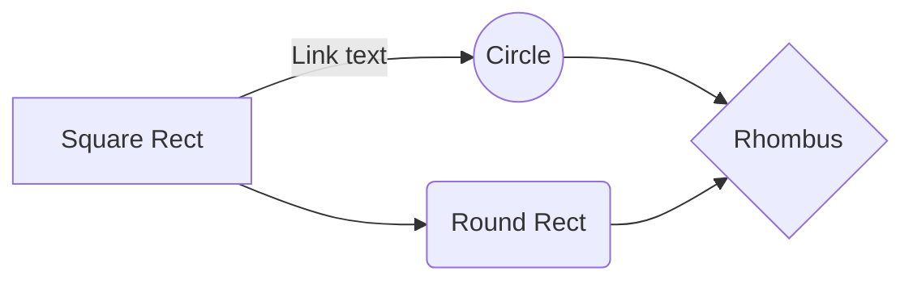

the whole relationship is like this:

database -> schema -> table/view -> index


```mermaid

graph LR
    A[Square Rect] -- Link text --> B((Circle))
    A --> C(Round Rect)
    B --> D{Rhombus}
    C --> D

```

# database

## create

```
create database <your database name>
```

